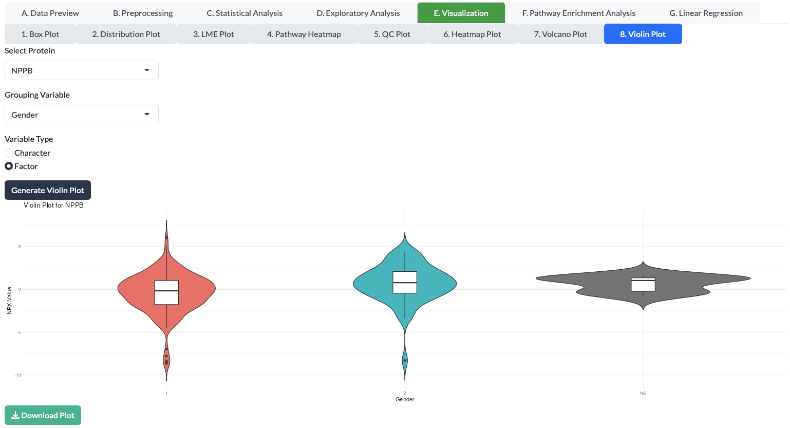
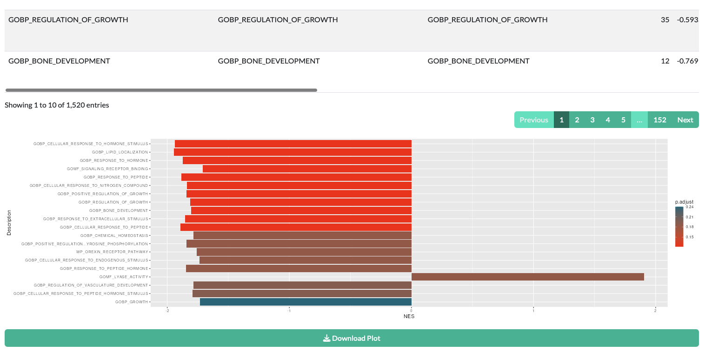

# OlinkWrapper App Documentation
Welcome to the documentation for the Olink Wrapper App. This guide is designed to help you understand how to use the app, the scientific principles behind the data, and the technical stack that powers it.

??? important "Note to Users"

    For each analysis, a progress bar will appear to indicate that calculations are in progress.

    - If any errors occur during analysis, an error message will be displayed.
    - Make sure your data is properly formatted before uploading:
        - **NPX Data** should contain columns for `SampleID`, `Assay`, and `NPX` values.
        - **Key File** should map `SampleID` to `SUBJID` (Subject Identifier).
        - **Variables File** should contain additional variables for each `SUBJID` (Subject Identifier).

    This app provides a user-friendly interface for comprehensive analysis of Olink™ data.  
    If you encounter any issues or have questions about the results, please consult with a statistician or a bioinformatics expert for proper interpretation.

## 1. App User Manual: A Step-by-Step Guide
The Olink Wrapper App is a user-friendly tool for the analysis and visualization of Olink proteomics data. The app's interface is divided into several panels that guide you through a typical data analysis workflow, from uploading your data to generating publication-ready plots.

### 1.1 Getting Started: Data Input

The app requires specific data files to begin analysis.

- **Upload NPX Data (CSV):** This is the main data file containing your Normalized Protein Expression (NPX) values. It should have columns for SampleID, Assay, and NPX.
- **Upload Key File (CSV, optional):** A file that contains information to match your SampleID to metadata from a different source. This is useful if your primary NPX data lacks sufficient sample metadata.
- **Upload Variables File (CSV):** This file contains all your sample-level metadata, such as SubjectID, Treatment, TimePoint, or any other experimental variables you want to use for analysis and plotting.

??? tip "Demo Data Download"
    Please download the demo data from the following link to practice with the olinkWrapper app: <a href="https://sourceforge.net/projects/olinkwrapper/" target="_blank" rel="noopener">https://sourceforge.net/projects/olinkwrapper/</a>

    **Remember: download all three files.**

After uploading your files, click "Merge Data" to combine them into a single dataset for analysis. You can preview the merged data in the **A. Data Preview** tab.

## B. Preprocessing

This section allows you to clean and prepare your data for statistical analysis.

### B.1 **Bridge Selector:** 
This step is crucial for quality control when you have data from multiple Olink panels. It allows you to select which "bridge" protein data to use, ensuring consistency across different runs.

### B.2 **Normalization:** 
This function applies methods to adjust NPX values, helping to reduce technical variation and make the data more comparable across samples.

### B.3 **LOD (Limit of Detection):** 
Here, you can filter out proteins with NPX values below the assay's limit of detection. This ensures that you only analyze reliable measurements, improving the quality of your results.

### B.4 **Outlier Detection:** 
This tool helps you identify and optionally remove samples or assays that are statistically unusual, which may be due to experimental errors.

## C. Statistical Analysis: Fundamentals & Manual

The app provides several common statistical tests to find meaningful differences in your data.

### C.1 **Normality Test:** 
This test determines if your data follows a normal (bell-shaped) distribution. Many parametric tests, like the T-test and ANOVA, assume normality.

**How to run:** Select your variables and click the "Normality Test" button to check the distribution of your data.

### C.2 **T-test:** 
A T-test is used to determine if there is a significant difference between the means of two groups.

**How to run:** 

- Navigate to the "T-Test" tab.
- Select a grouping variable and specify its type (Character or Factor).
- Click "Run T-Test" to perform the analysis.
- Results will be displayed in a table.
- Use the "Download Results" button to save the T-Test results as an Excel file.

### C.3 **Wilcoxon Test:** 
This is a non-parametric alternative to the T-test. It is used when your data is not normally distributed or when you have ordinal data. It checks if there is a significant difference between two groups without assuming a specific distribution.

**How to run:** Select a grouping variable and click "Wilcoxon Test."

### C.4 **ANOVA (Analysis of Variance):** 
ANOVA is used to compare the means of three or more groups to see if at least one group mean is different from the others.

**How to run:**

- In the "ANOVA" tab, select a grouping variable and its type.
- Choose the number of covariates (0-4) if needed.
- If covariates are selected, choose the covariate variables from the dropdown menus.
- Click "Run ANOVA" to perform the analysis.
- Results will be displayed in a table.
- Use the "Download Results" button to save the ANOVA results as an Excel file.

### C.5 **ANOVA Post-hoc:** 
If an ANOVA test is significant, a post-hoc test is used to determine which specific groups are different from each other.

**How to run:** After running ANOVA, select the groups you want to compare and run the post-hoc test.

!!! important "ANOVA Post-hoc"
    Please ensure you have run the ANOVA test before attempting to run the ANOVA Post-hoc test, as it relies on the results from that analysis.

### C.6 **Linear Mixed Effects (LME) and Post-hoc:** 
LME models are powerful tools used for analyzing data where samples are not independent, such as longitudinal studies where the same subjects are measured at different time points.

**How to run:** Define both fixed effects (e.g., Treatment) and random effects (e.g., SubjectID) in the app's interface and click "LME." Use the post-hoc function to find specific differences.

## D. Exploratory Analysis: Finding Patterns

Exploratory analysis helps you visualize the overall structure of your data and find patterns without making specific assumptions.

### D.1 **PCA Plot (Principal Component Analysis):** 
PCA is a method that reduces the dimensionality of your data, allowing you to visualize hundreds of proteins in a simple 2D or 3D plot. Samples that are similar in protein expression will cluster together.

**How to run:** Select the variables to color or shape your plot and click "PCA."

### D.2 **UMAP Plot (Uniform Manifold Approximation and Projection):** 
Similar to PCA, UMAP is a non-linear dimensionality reduction technique that is often more effective at revealing complex relationships and clusters in your data.

**How to run:** Select your grouping variables and click "UMAP."

## E. Visualization: Creating Plots

The app generates a variety of plots to help you understand and present your results.

### E.1 **Box Plot:** 
A box plot provides a quick visual summary of the distribution of NPX values for a single protein across different groups, showing the median, quartiles, and outliers.

### E.2. **Distribution Plot:** 
This plot, often a histogram or density plot, shows the frequency distribution of NPX values for a given protein.

### E.3 **LME Plot:** 
This plot visualizes the results of a Linear Mixed Effects model, often showing the protein expression change over time or across different conditions, accounting for within-subject variability.

### E.4 **Pathway Heatmap:** 
A heatmap is a color-coded matrix that shows the expression levels of proteins involved in a specific biological pathway. It requires you to first run a Pathway Enrichment Analysis.

!!! important "Pathway Heatmap"
    Please ensure you have run the Pathway Enrichment Analysis before attempting to create a Pathway Heatmap, as it relies on the results from that analysis.

### E.5 **QC Plot (Quality Control):** 
This plot helps you assess the quality of your data, often by showing the overall NPX distribution across all samples or assays.

### E.6 **Heatmap Plot:** 
A general heatmap that displays the expression of many proteins across many samples, allowing you to see global patterns and clusters of co-expressed proteins.

### E.7 **Volcano Plot:** 
A key visualization for T-test or Wilcoxon results. It plots the statistical significance (p-value) against the magnitude of change (fold change or effect size) for all proteins, making it easy to spot significant differences.

- Go to the "Volcano Plot" tab.
- Select a grouping variable and its type.
- Click "Generate Volcano Plot" to create the plot.
- Use the "Download Plot" button to save the Volcano plot.

!!! tip "Volcano Plot"
    Please ensure you have run either the T-test or Wilcoxon test before attempting to create a Volcano Plot, as it relies on the results from those analyses.

### E.8 **Violin Plot:** 
Similar to a box plot, but it also shows the density of the data at different NPX values, providing a more detailed look at the data distribution.

- In the "Violin Plot" tab, select a protein and a grouping variable.
- Specify the variable type for the grouping variable.
- Click "Generate Violin Plot" to create the plot.
- Use the "Download Plot" button to save the Violin plot.

## F. Pathway Enrichment Analysis

This is a powerful method to go beyond individual protein analysis. It uses your list of significantly changed proteins (identified by a **T-test** or **Wilcoxon test**) and compares them to known biological pathways. It tells you which pathways are significantly represented in your list of proteins, helping you interpret your findings in a biological context.

!!! warning "Pathway Enrichment Analysis"
    Please ensure you have run either the T-test or Wilcoxon test before attempting to run the Pathway Enrichment Analysis, as it relies on the results from those analyses.

## G. Linear Regression

Linear regression is used to model the relationship between a protein's NPX value (dependent variable) and one or more other variables (independent variables), such as age, BMI, or a clinical score. This helps you identify proteins whose levels are associated with continuous variables.

## References
1. Olink Proteomics Official Website: https://www.olink.com/
2. Assarsson, E. et al. (2014). "A single-tube, quantitative technique for high-throughput protein analysis." Nature Methods, 11(6), 665–670.
3. OlinkAnalyze R Package: [https://cran.r-project.org/web/packages/OlinkAnalyze/refman/OlinkAnalyze.html](https://cran.r-project.org/web/packages/OlinkAnalyze/refman/OlinkAnalyze.html)
4. OlinkAnalyze Vigenette: [https://cran.r-project.org/web/packages/OlinkAnalyze/vignettes/Vignett.html](https://cran.r-project.org/web/packages/OlinkAnalyze/vignettes/Vignett.html) 