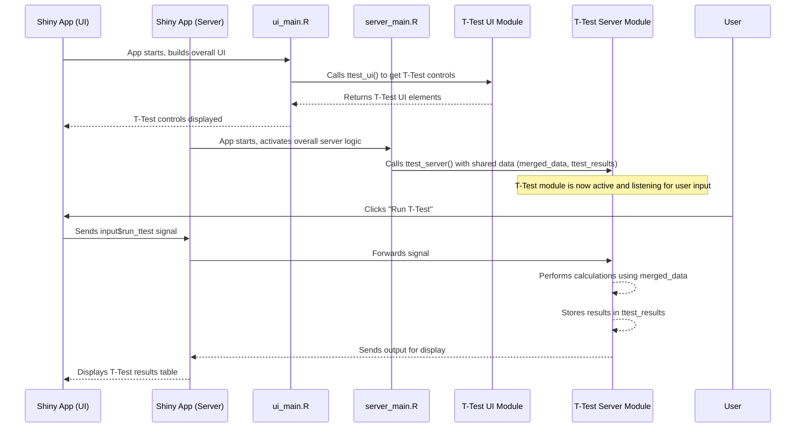

# Chapter 5: Module-Based Development

Welcome back, `ShinyOlink` enthusiast! In [Chapter 4: Shiny Application Structure](chapter4.md), we learned that every Shiny app has a User Interface (UI) and Server logic, and how `app.R` brings them together. You also saw that `ShinyOlink` is a big app, and its UI and Server code are split into many files like `ui_main.R` and `server_main.R`.

While splitting code into files is a good start, for very large applications like `ShinyOlink` with many features, even splitting can become messy. Imagine trying to manage dozens of separate UI and server files and making sure they all play nicely together!

## What is "Module-Based Development"?

Think of building with LEGO bricks. You don't just get a giant pile of plastic and start melting it together. Instead, you get pre-made bricks of different shapes and sizes – a window brick, a door brick, a wall brick. Each brick is a self-contained unit that does one job. You can build a small house or a huge castle by simply snapping these bricks together.

**The main problem "Module-Based Development" solves is this:** How do we organize a complex Shiny application, with many different features (like T-tests, ANOVA, PCA, etc.), so that the code is easy to understand, maintain, and reuse?

In `ShinyOlink`, instead of putting all the code for, say, the T-test feature directly into `ui_main.R` and `server_main.R`, we package it up as a "module." This module has its own UI part and its own server part, specifically designed to handle everything related to T-tests.

Let's use our T-test feature as an example: The goal is to compare protein levels between two groups and display the results and a Volcano Plot. With modules, we treat this entire feature – its buttons, tables, plots, and the logic that makes them work – as one independent, reusable "brick."

## Key Concepts: Your Reusable LEGO Bricks

A Shiny "module" is essentially a pair of functions: one for the UI and one for the server logic. They work together to create a self-contained, reusable piece of your application.

| Concept         | Description                                                          | Analogy                                        |
| :-------------- | :------------------------------------------------------------------- | :--------------------------------------------- |
| **Module UI Function** | Defines the user interface (buttons, inputs, outputs) for *just that specific feature*. | A specialized LEGO brick, like a pre-assembled window. |
| **Module Server Function** | Contains the logic that reacts to inputs and generates outputs for *just that specific feature*. | The internal mechanism that makes the LEGO window open and close. |
| **Encapsulation** | Each module keeps its code and internal workings separate from other modules. | Each LEGO brick works independently, without interfering with others. |
| **Reusability** | You can use the same module multiple times in different parts of your app, or even in different apps! | You can use the same window brick in many houses or castles. |

## How to Use Modules in `ShinyOlink`

`ShinyOlink` is built almost entirely using modules. Each major analysis or visualization feature (like ANOVA, PCA, T-Test, Volcano Plot) has its own dedicated pair of UI and server module files.

When you interact with `ShinyOlink`:

1.  The **main UI (`ui_main.R`)** calls the UI functions of various modules to build the overall layout. For example, it calls `ttest_ui()` to put the T-Test controls on the screen.
2.  The **main Server (`server_main.R`)** calls the server functions of these modules to activate their specific logic. For example, it calls `ttest_server()` to handle what happens when you click the "Run T-Test" button.

Let's revisit our T-test example. To make the T-test feature available, `ShinyOlink` does not just add elements directly to `ui_main.R` and `server_main.R`. Instead, it includes the T-test module's UI and server functions.

### Example: The T-Test Module

Recall from [Chapter 2: Statistical Analysis & Visualization Modules](02_statistical_analysis___visualization_modules_.md) that we have a file called `app/ui/ui_ttest.R` and another called `app/server/server_ttest.R`. These files define the T-Test module.

Here's a simplified look at the `ttest_ui` function:

```R

# app/ui/ui_ttest.R (Simplified T-Test Module UI)
ttest_ui <- function() {
  tagList( # tagList helps organize multiple UI elements
    selectInput("ttest_var", "Grouping Variable", choices = NULL),
    radioButtons("ttest_var_type", "Variable Type", choices = c("Character", "Factor")),
    actionButton("run_ttest", "Run T-Test", class = "btn-primary"),
    DTOutput("ttest_output"), # Output for the results table
    downloadButton("download_ttest", "Download Results")
  )
}
```
**Explanation:** This `ttest_ui` function is the **Module UI function**. It defines all the dropdowns, buttons, and places where outputs (like the table) will appear, *specifically* for the T-test feature. When the main application wants to show the T-test section, it simply "calls" this function, and all these elements show up.

And here's a simplified look at the `ttest_server` function:

```R

# app/server/server_ttest.R (Simplified T-Test Module Server)
ttest_server <- function(input, output, session, merged_data, ttest_results) {
  observeEvent(input$run_ttest, {
    req(merged_data(), input$ttest_var)
    data_for_test <- merged_data()
    # ... (code to prepare data and call olink_ttest) ...
    results <- olink_ttest(data_for_test, variable = input$ttest_var)
    ttest_results(results) # Store results for other modules
    output$ttest_output <- renderDT({
      datatable(results)
    })
  })
  # ... (code for downloading results) ...
}
```
**Explanation:** This `ttest_server` function is the **Module Server function**. It contains all the "brain" logic for the T-test. It listens for the `run_ttest` button click, gets the `merged_data` (our input), runs the `olink_ttest` function (from [Chapter 3: OlinkAnalyze Package Integration](03_olinkanalyze_package_integration_.md)), and then updates `ttest_results` and `output$ttest_output` (our outputs). Notice how it also takes `merged_data` and `ttest_results` as inputs – this is how modules can share information!

## Under the Hood: Plugging in the LEGO Bricks

Let's see how these `ttest_ui` and `ttest_server` "LEGO bricks" are plugged into the main `ShinyOlink` application.

### Step-by-Step Walkthrough

1.  **Main UI Calls Module UI:** When `ShinyOlink` starts, its main UI definition (in `app/ui/ui_main.R`) includes a line that calls the `ttest_ui()` function. This tells Shiny to draw all the T-Test specific buttons and inputs on the screen.
2.  **Main Server Calls Module Server:** Similarly, the main server logic (in `app/server/server_main.R`) includes a line that calls the `ttest_server()` function. This activates the T-Test module's brain, making it ready to listen for clicks and perform calculations.
3.  **Data Flow:** When the `ttest_server()` is called, it's given access to important shared data, like `merged_data` (our combined Olink dataset from [Chapter 1: Data Ingestion & Preparation](01_data_ingestion___preparation_.md)) and a place to store its results, like `ttest_results`. This allows the module to work with the data and pass its outcomes to other parts of the app (like the Volcano Plot module).

Here's a simple diagram to visualize this process:



### Diving into the Code: The "Plug-in" Lines

The key to module-based development in `ShinyOlink` lies in `app/ui/ui_main.R` and `app/server/server_main.R`, where these modules are called.

#### Calling Module UI in `app/ui/ui_main.R`

To include the T-Test UI in the application, `ui_main.R` first needs to know where `ttest_ui.R` is, and then it calls the function.

```R

# app/ui/ui_main.R (Simplified for calling T-Test UI)
# ... other library and source calls ...
source("ui/ui_ttest.R") # This line tells R where to find the ttest_ui function

single_ui <- function() {
  page_sidebar(
    # ... general app layout ...
    navset_tab(
      nav_panel("C. Statistical Analysis",
        navset_pill(
          nav_panel("2. T-Test", ttest_ui()) # This line *calls* the T-Test UI module!
        )
      )
      # ... other nav_panels ...
    )
    # ... footer content ...
  )
}
```
**Explanation:** The `source("ui/ui_ttest.R")` line loads the code from the `ui_ttest.R` file, making the `ttest_ui` function available. Then, `nav_panel("2. T-Test", ttest_ui())` is where the `ttest_ui` function is called. When `ShinyOlink` builds its interface, it executes `ttest_ui()`, and all the UI elements defined in that module function are added to the "T-Test" tab.

#### Calling Module Server in `app/server/server_main.R`

The server side works similarly. The `server_main.R` file first sources all the individual server module files and then calls their functions.

```R

# app/server/server_main.R (Simplified for calling T-Test Server)
# ... many lines sourcing other server module files ...
source(file.path("server", "server_ttest.R")) # This line loads the ttest_server function
# ... more source calls ...

server_main <- function(input, output, session, merged_data, var_key_merged, ttest_results) {
  # ... other reactive values ...
  
  # This line *calls* the T-Test Server module!
  safe_call(ttest_server, input, output, session, merged_data, ttest_results)
  
  # ... calls to many more server modules ...
}
```
**Explanation:**
*   `source(file.path("server", "server_ttest.R"))` loads the `ttest_server` function.
*   `safe_call(ttest_server, input, output, session, merged_data, ttest_results)` is the crucial line. This calls the `ttest_server` function. It passes `input`, `output`, and `session` (standard Shiny variables) along with `merged_data` (the main dataset shared across the app) and `ttest_results` (a reactive value where the T-test results will be stored and can be accessed by other modules, like the Volcano Plot). The `safe_call` function is a helper used in `ShinyOlink` to ensure robustness, but conceptually, it's just calling `ttest_server(...)`.

This modular approach makes `ShinyOlink` much more manageable. If there's an issue with the T-test calculations, developers know exactly which files (`ui_ttest.R` and `server_ttest.R`) to look at, without affecting other parts of the application. It also makes it easy to add new features later – just create a new module pair and plug it in!

## Conclusion

In this chapter, you've learned about the power of **Module-Based Development** in `ShinyOlink`:

*   It helps organize complex Shiny applications by breaking them into smaller, self-contained **"LEGO bricks"** (UI function + Server function pairs).
*   Each module is responsible for a specific feature, making the code easier to **understand, maintain, and reuse**.
*   You saw how `ShinyOlink` uses this approach, with `ui_main.R` calling module UI functions and `server_main.R` activating module server functions, passing shared data between them.

This modular structure is a cornerstone of building robust and scalable Shiny applications. It also sets the stage for understanding how data flows and changes within the app, which is handled by a concept called "Reactive Programming."

Ready to understand how these modules dynamically respond to your actions? Let's move on to [Chapter 6: Reactive Programming](chapter6.md)!