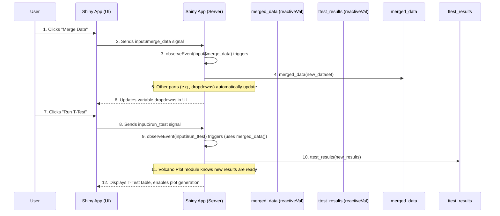

# Chapter 6: Reactive Programming

Welcome back, `ShinyOlink` enthusiast! In [Chapter 5: Module-Based Development](chapter5.md), we learned how `ShinyOlink` organizes its code into smaller, reusable "LEGO bricks" called modules. This modular design helps keep the code tidy and makes the application easier to manage.

But how do these individual "bricks" communicate with each other? How does a change you make in one part of the app (like uploading data) automatically affect another part (like updating the list of variables you can analyze)? This is where **Reactive Programming** comes in!

## What is "Reactive Programming"?

Imagine you're working with a spreadsheet. When you change a number in one cell, all the formulas in other cells that depend on that number automatically recalculate and update their results. You don't have to tell each formula to re-run; they just *react* to the change.

**The main problem Reactive Programming solves is this:** How do we make a web application feel "alive" and responsive, so that when a user does something (like clicking a button or typing text), other parts of the application automatically update without the user having to refresh the page or manually trigger every single change?

In `ShinyOlink`, reactive programming is the magic that allows the app to respond dynamically to your actions. For example:

*   When you **upload your data** and click "Merge Data" (from [Chapter 1: Data Ingestion & Preparation](chapter1.md)), `ShinyOlink` automatically updates the dropdown menus in all the analysis modules (like T-Test or ANOVA) with the new column names from your merged dataset.
*   When you **run a T-Test** (from [Chapter 2: Statistical Analysis & Visualization Modules](chapter2.md)), the app automatically makes those results available, and the Volcano Plot module then knows exactly which data to use to draw the plot.

This makes the `ShinyOlink` app seamless and intuitive, just like that responsive spreadsheet.

## Key Concepts: The Brain's Connections

Shiny applications are built on this idea of "reactivity." This means that when certain pieces of information (inputs) change, other pieces of the application that depend on them (outputs or calculations) automatically update. Two fundamental tools make this happen:

### 1. `reactiveVal`: The Dynamic Whiteboard

`reactiveVal` is a special type of variable in Shiny that can **store data that changes over time**. Think of it like a **shared whiteboard** that different parts of the app can read from and write to. When someone writes new information on this whiteboard, everyone else who is "watching" it automatically knows there's an update.

*   **Purpose:** To hold dynamic data that needs to be shared and updated across different parts of your Shiny app.
*   **Analogy:** A "sticky note" or a shared "whiteboard" where the app stores important, changing information, like your `merged_data` or the `ttest_results`.
*   **Example in `ShinyOlink`:**
    *   `merged_data`: This `reactiveVal` holds your combined Olink dataset after you upload and merge your files.
    *   `ttest_results`: This `reactiveVal` stores the statistical results generated by the T-Test module.

### 2. `observeEvent`: The Smart Listener

`observeEvent` is a special function that **listens for specific actions or changes** and then runs a block of code in response. It's like having a dedicated sensor that only triggers when something particular happens.

*   **Purpose:** To run code only when a specific "event" occurs (e.g., a button is clicked, or a `reactiveVal` changes its value).
*   **Analogy:** A "sensor" or "alarm" that goes off only when you press a specific button, or when someone updates a specific whiteboard (`reactiveVal`).
*   **Example in `ShinyOlink`:**
    *   `observeEvent(input$merge_data, {...})`: This listens for you to click the "Merge Data" button. When you click it, the code inside the curly braces runs to merge your data.
    *   `observeEvent(input$run_ttest, {...})`: This listens for you to click the "Run T-Test" button. When clicked, it runs the code to perform the T-test calculation.

### How They Work Together

`observeEvent` often works with `reactiveVal`. An `observeEvent` might trigger when a button is clicked, and then the code it runs might *update* a `reactiveVal`. Other parts of the app, in turn, can *read* from that `reactiveVal` to perform their own actions, automatically reacting to the change. This creates a chain of reactions throughout the app.

## How `ShinyOlink` Uses Reactive Programming

Let's trace our familiar examples to see reactive programming in action.

### Scenario 1: Data Upload -> Variable Updates

1.  **You upload your NPX and Variables files** and click the "Merge Data" button.
2.  The `ShinyOlink` app uses an `observeEvent` to detect this button click.
3.  Inside that `observeEvent`, the app reads your files, performs the merging, and then **updates the `merged_data` `reactiveVal`** with your new, combined dataset.
4.  Crucially, other parts of the app that rely on `merged_data` automatically "notice" this change. For instance, the dropdown menus in the T-Test, ANOVA, and PCA modules, which need to show the column names from your data, automatically update to display the new columns from your freshly merged `merged_data`. You don't have to click a "refresh variables" button!

### Scenario 2: T-Test Results -> Volcano Plot Readiness

1.  **You click the "Run T-Test" button** in the T-Test module.
2.  An `observeEvent` detects this click.
3.  The T-Test calculations are performed using your `merged_data`. The results (p-values, fold changes) are then **stored in the `ttest_results` `reactiveVal`**.
4.  Now, when you go to the Volcano Plot module and click "Generate Volcano Plot," it immediately **reads from the `ttest_results` `reactiveVal`** to get the latest statistical output. The Volcano Plot doesn't need to re-run the T-test; it just uses the ready-made results, ensuring efficiency and consistency.

This continuous flow of information, where changes in one place automatically trigger updates in others, is the essence of reactive programming in Shiny.

## Under the Hood: The Automatic Chain Reaction

Let's look at a simplified walkthrough of how these reactive elements connect behind the scenes.

### Step-by-Step Walkthrough

1.  **You Interact:** You click the "Merge Data" button in the `ShinyOlink` User Interface (UI).
2.  **Event Detected:** The `ShinyOlink` Server's `observeEvent` listening for `input$merge_data` detects your click and begins its associated code.
3.  **Data Updated:** This code performs the file merging and then updates the `merged_data` `reactiveVal` with the new dataset.
4.  **Dependencies React:** Any part of the app (including `updateSelectInput` calls that refresh dropdown choices) that uses `merged_data()` automatically *reacts* to this change and updates itself.
5.  **You Interact Again:** You then select a grouping variable in the T-Test module and click "Run T-Test."
6.  **Event Detected:** The `observeEvent` listening for `input$run_ttest` in the T-Test module detects this click.
7.  **Calculations Performed:** This code uses the *current* `merged_data()` (which it automatically gets from the `reactiveVal`) to perform the T-test calculation.
8.  **Results Updated:** The T-test results are then saved into the `ttest_results` `reactiveVal`.
9.  **Dependencies React:** The Volcano Plot module, which is set up to use `ttest_results()`, now knows that fresh T-test results are available and is ready to generate the plot.

Here's a simple diagram to visualize this reactive flow:



### Diving into the Code: Reactive Components

Let's look at simplified code snippets showing how `reactiveVal` and `observeEvent` are used.

First, in `app/app.R`, you declare your main `reactiveVal` containers. Think of this as setting up your whiteboards for the app:

```R

# app/app.R (Simplified)
# ... (other code) ...

server <- function(input, output, session) {
  # These are our dynamic whiteboards (reactiveVal containers)
  merged_data <- reactiveVal(NULL) # Starts empty
  ttest_results <- reactiveVal(NULL) # Starts empty

  # ... (more server logic) ...
}
```
**Explanation:** `merged_data <- reactiveVal(NULL)` creates a special container named `merged_data` that can hold data, and it starts with nothing inside (`NULL`). The same applies to `ttest_results`. These `reactiveVal`s are passed around to different modules so they can share information.

Next, in `app/server/server_data_input.R`, you see how `merged_data` is updated after file merging:

```R

# app/server/server_data_input.R (Simplified)
data_input_server <- function(input, output, session, merged_data, var_key_merged) {
  observeEvent(input$merge_data, { # This is our "smart listener" for the button click
    req(input$npx_file, input$var_file) # Makes sure files are uploaded

    # ... (code to read and merge files into a 'merged' variable) ...

    merged_data(merged) # WRITE to the 'merged_data' reactiveVal whiteboard!

    # These lines automatically update dropdowns because merged_data changed
    updateSelectInput(session, "pca_var", choices = colnames(merged))
    updateSelectInput(session, "ttest_var", choices = colnames(merged))
    # ... (more updates) ...
  })
}
```
**Explanation:** The `observeEvent(input$merge_data, {...})` waits for the "Merge Data" button click. Once clicked, the code inside runs. `merged_data(merged)` is the key line: it *writes* the newly combined `merged` dataset onto the `merged_data` whiteboard. Because this whiteboard was updated, other inputs like `updateSelectInput` (which dynamically updates the options in dropdown menus) automatically react and display the new column names found in `merged_data`.

Now, in `app/server/server_ttest.R`, you see how `ttest_results` is updated:

```R

# app/server/server_ttest.R (Simplified)
ttest_server <- function(input, output, session, merged_data, ttest_results) {
  observeEvent(input$run_ttest, { # Listener for the T-Test button
    req(merged_data(), input$ttest_var) # Requires merged_data to be available

    data_for_test <- merged_data() # READ from the 'merged_data' reactiveVal whiteboard!

    # ... (code to prepare data for test) ...

    results <- olink_ttest(data_for_test, variable = input$ttest_var)

    ttest_results(results) # WRITE to the 'ttest_results' reactiveVal whiteboard!

    # ... (code to display results table) ...
  })
}
```
**Explanation:** `observeEvent(input$run_ttest, {...})` listens for the "Run T-Test" button. `data_for_test <- merged_data()` *reads* the latest combined dataset from the `merged_data` whiteboard. After the `olink_ttest` function calculates the results, `ttest_results(results)` *writes* these new results onto the `ttest_results` whiteboard, making them available to other modules, like the Volcano Plot.

Finally, in `app/server/server_volcano_plot.R`, the Volcano Plot module simply *reads* the T-Test results:

```R

# app/server/server_volcano_plot.R (Simplified)
volcano_plot_server <- function(input, output, session, merged_data, ttest_results, anova_results) {
  observeEvent(input$run_volcano, { # Listener for "Generate Volcano Plot"
    if (input$volcano_plot_type == "ttest") {
      req(ttest_results()) # Makes sure T-Test results exist on the whiteboard
      results <- ttest_results() # READ from the 'ttest_results' reactiveVal whiteboard!
    } else {
      # ... (code for ANOVA results) ...
    }

    plot <- olink_volcano_plot(results) # Create the plot using the results
    # ... (code to display plot) ...
  })
}
```
**Explanation:** When you click "Generate Volcano Plot," the `observeEvent` triggers. If "T-test" is selected, `results <- ttest_results()` *reads* the latest T-test results directly from the `ttest_results` whiteboard. The `olink_volcano_plot` then immediately uses these results to draw the graph. This shows how `reactiveVal`s effectively pass data around the application, allowing different parts to react and update automatically.

## Conclusion

In this chapter, you've grasped the core concept of **Reactive Programming** in `ShinyOlink`:

*   It's the mechanism that makes your app **dynamic and responsive**, automatically updating outputs when inputs change, much like a spreadsheet.
*   You learned about two key components: **`reactiveVal`** (the "dynamic whiteboard" for storing changing data) and **`observeEvent`** (the "smart listener" that triggers code when specific actions occur).
*   You saw how these work together to allow data to flow seamlessly through the application, enabling features like automatic variable updates after data ingestion and plot generation from fresh analysis results.

Understanding reactivity is fundamental to truly grasping how `ShinyOlink` (and any Shiny application) functions. Now that you know how the app responds to your actions, let's look at how such an application is prepared for others to use, even outside of your own computer.

Ready to see how `ShinyOlink` can be shared with the world? Let's move on to [Chapter 7: Automated Deployment Pipelines](chapter7.md)!