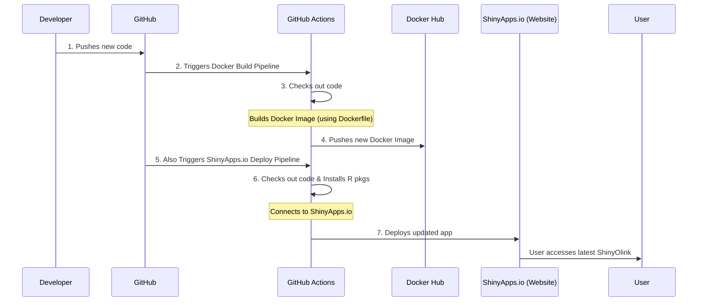

# Chapter 7: Automated Deployment Pipelines

Welcome back, `ShinyOlink` enthusiast! In [Chapter 6: Reactive Programming](chapter6.qmd), you learned how `ShinyOlink` uses "reactivity" to make different parts of the app automatically update and respond to your actions, creating a smooth and interactive experience. You now understand how the app works on your computer.

But what happens when a developer makes a new improvement or fixes a bug in `ShinyOlink`? How do those changes get from their computer to the public website where everyone can use the updated version? Doing this manually for every change would be slow, prone to errors, and take a lot of effort!

## What are "Automated Deployment Pipelines"?

Imagine you run a factory that produces a popular product. Every time you have a new and improved version, you wouldn't want to manually gather all the parts, assemble them, test them, and then personally deliver each one to your customers. That would be chaotic! Instead, you'd want an **automated factory line** that takes your new design, builds it, checks its quality, and ships it out efficiently and reliably.

**The main problem "Automated Deployment Pipelines" solve is this:** How do we automatically take the latest changes to the `ShinyOlink` code, build a ready-to-use version of the application, test it, and then make it available for everyone to use online, all without tedious manual steps?

In `ShinyOlink`, this "automated factory line" is called an **Automated Deployment Pipeline**. When a developer writes new code and saves it to the project's central storage (GitHub), this pipeline automatically kicks into action. It ensures that the `ShinyOlink` application is built into a self-contained package (a "Docker image") and then released to a web server for you to use. This makes updates faster, more reliable, and less prone to human error.

Let's use a common scenario: A developer adds a new statistical analysis feature to `ShinyOlink`. Their goal is to make this new feature available on the public `ShinyOlink` website for users as quickly and smoothly as possible. The automated deployment pipeline handles everything after the developer finishes writing the code!

## Key Concepts: The Automated Factory Tools

Automated deployment pipelines rely on a few key tools and ideas to work their magic:

### 1. GitHub Actions: The Automated Worker

| Concept          | Description                                                                                                                                                                                            | Analogy                                     |
| :--------------- | :----------------------------------------------------------------------------------------------------------------------------------------------------------------------------------------------------- | :------------------------------------------ |
| **GitHub Actions** | A service provided by GitHub (where `ShinyOlink` code is stored) that allows you to automate tasks directly within your code repository. It's like having a **robot worker** that performs tasks for you. | The robot on the assembly line.             |
| **Workflows**    | These are instructions (written in YAML files) that tell GitHub Actions what to do, and when to do it. They define the "assembly line" steps.                                                            | The detailed instructions for the robot.    |

### 2. Docker: The Standardized Shipping Container

| Concept          | Description                                                                                                                                             | Analogy                                   |
| :--------------- | :------------------------------------------------------------------------------------------------------------------------------------------------------ | :---------------------------------------- |
| **Docker**       | A technology that allows you to package an application and all its necessary parts (code, libraries, settings) into a single, standardized unit called an **image**. | A standardized shipping container.        |
| **Docker Image** | A self-contained, lightweight, and executable package that has everything needed to run a piece of software. It's like a complete, pre-assembled product. | The product, neatly packed in its container, ready to be shipped anywhere. |
| **Dockerfile**   | A simple text file that contains instructions on how to build a Docker image (e.g., "start with R, then add these packages, then add the app code").     | The instruction manual for building the product inside the container. |

### 3. Docker Hub: The Warehouse

| Concept       | Description                                                               | Analogy                     |
| :------------ | :------------------------------------------------------------------------ | :-------------------------- |
| **Docker Hub** | A cloud-based repository (like a big online storage) for Docker images. | The warehouse where all the ready-to-ship products (Docker images) are stored. |

## How to Use Automated Deployment Pipelines (as a Developer)

For a developer working on `ShinyOlink`, using these pipelines is remarkably simple:

1.  **Write Code:** The developer writes new R code for a feature or bug fix.
2.  **Save & Push:** They save their changes and "push" them to the `ShinyOlink` project on GitHub.

That's it! Once the code is pushed to GitHub, the automated pipeline takes over. The developer doesn't need to manually run any commands to build the Docker image or deploy the app to the web. The GitHub Actions robots handle everything, making sure the latest `ShinyOlink` is always available online.

## Under the Hood: The Automatic Journey

Let's trace the journey of `ShinyOlink` from a developer's computer to the public website, step-by-step.

### Step-by-Step Walkthrough

1.  **Developer Pushes Code:** A `ShinyOlink` developer finishes their work and pushes new code changes to the `main` branch of the `ShinyOlink` project on GitHub.
2.  **GitHub Actions Triggers:** GitHub detects these new changes. Since the project has pre-defined "workflows" (our instructions for the robots), GitHub Actions automatically starts two separate pipelines:
    *   **Pipeline 1: Docker Image Build & Push:** This pipeline focuses on creating a new, updated Docker image for `ShinyOlink`. It tells Docker how to package the app and then sends it to Docker Hub.
    *   **Pipeline 2: ShinyApps.io Deployment:** This pipeline takes the latest app code and deploys it directly to the ShinyApps.io platform, making it accessible as a public website.

3.  **Inside Pipeline 1 (Docker Build):**
    *   GitHub Actions checks out (gets a copy of) the latest `ShinyOlink` code.
    *   It reads the `Dockerfile` (the building instructions) and uses Docker to create a new, self-contained `ShinyOlink` image. This image includes R, all necessary R packages (like `OlinkAnalyze` from [Chapter 3: OlinkAnalyze Package Integration](03_olinkanalyze_package_integration_.md)), and the `ShinyOlink` application code itself.
    *   Once the image is built, GitHub Actions logs into Docker Hub and "pushes" the newly built image to the `ShinyOlink` repository there, making it available in the "warehouse."

4.  **Inside Pipeline 2 (ShinyApps.io Deploy):**
    *   GitHub Actions again checks out the latest `ShinyOlink` code.
    *   It sets up R and installs all the specific R packages that `ShinyOlink` needs to run (like `shiny`, `rsconnect`, and many others).
    *   It then uses special credentials (secrets, kept safe on GitHub) to log into the `ShinyApps.io` deployment service.
    *   Finally, it instructs `ShinyApps.io` to deploy the `ShinyOlink` application using the latest code. This updates the public website with the new version.

This entire process, from code push to live application, happens automatically, saving a lot of time and effort!

Here's a simple diagram to visualize this automated flow:



### Diving into the Code: The Workflow Files

The instructions for these automated pipelines are defined in special YAML files located in the `.github/workflows/` folder of the `ShinyOlink` project. Let's look at simplified parts of these files.

#### 1. Docker Image Build Workflow (`.github/workflows/docker-build.yml`)

This file tells GitHub Actions how to build and push the Docker image to Docker Hub:

```yaml
# .github/workflows/docker-build.yml (Simplified)
name: docker-image

on:
  push: # This pipeline runs every time new code is pushed

jobs:
  docker:
    runs-on: ubuntu-latest # Run this job on a standard Ubuntu machine
    steps:
      - name: Checkout
        uses: actions/checkout@v4 # Get the latest code from GitHub
      - name: Login to Docker Hub
        uses: docker/login-action@v3
        with:
          username: ${{ secrets.DOCKERHUB_USERNAME }}
          password: ${{ secrets.DOCKERHUB_TOKEN }} # Use secret credentials for login
      - name: Build and push
        uses: docker/build-push-action@v6 # This action builds and pushes the Docker image
        with:
          context: . # Look for the Dockerfile in the current folder
          push: true # Yes, push the image to Docker Hub
          tags: |
            jd21/shinyolink:latest # Tag the image as 'latest'
            # ... other tags like date-based versions ...
```
**Explanation:**
*   `on: push:`: This is the trigger. It means this "job" will run automatically every time a developer pushes new code to *any* branch.
*   `uses: actions/checkout@v4`: This step is like telling the robot to "get a copy of all the project files."
*   `Login to Docker Hub`: This step uses secure "secrets" (which are configured in GitHub and not visible in the code) to log into Docker Hub.
*   `Build and push`: This is the core step. It uses a special pre-made "action" (`docker/build-push-action`) to build the Docker image using the `Dockerfile` in the project and then push it to `jd21/shinyolink` on Docker Hub, labeling it as `latest`.

#### The Dockerfile (`Dockerfile`)

This file contains the actual instructions for building the `ShinyOlink` Docker image:

```dockerfile
# Dockerfile (Simplified)
FROM jd21/shinyolink:v1.2 # Start building from a specific base R image

USER root

# Install system dependencies needed by R packages
RUN apt-get update && apt-get install -y \
    libcurl4-openssl-dev \
    # ... more system libraries ...

# Install R packages needed for ShinyOlink
RUN R -e "\
    install.packages('BiocManager', repos='https://cran.rstudio.com/'); \
    BiocManager::install(version = '3.20'); \
    # ... many more R package installations ...
    "

# Create a folder inside the Docker image for the app
RUN mkdir -p /srv/shiny-server/app_cache && \
    chown -R shiny:shiny /srv/shiny-server/app_cache

# Copy the ShinyOlink application files into the image
COPY app/ /srv/shiny-server/

# Tell the Docker image that the app will listen on port 3838
EXPOSE 3838

# When the Docker image runs, start the Shiny server
CMD ["/usr/bin/shiny-server"]
```
**Explanation:**
*   `FROM jd21/shinyolink:v1.2`: This tells Docker to start building the image from an existing base image that already has R installed. It's like starting with a pre-built foundation.
*   `RUN ...`: These lines execute commands inside the Docker image during its creation. They install necessary system libraries (like tools for handling secure internet connections) and then install all the R packages `ShinyOlink` depends on (like `shiny`, `OlinkAnalyze`, `clusterProfiler`, etc.).
*   `COPY app/ /srv/shiny-server/`: This copies all the `ShinyOlink` application's R files (UI, server, modules, etc.) into the correct location within the Docker image.
*   `EXPOSE 3838`: This tells the outside world that this Docker container will serve a web application on port 3838.
*   `CMD ["/usr/bin/shiny-server"]`: This is the command that runs automatically when someone starts a container from this Docker image. It starts the Shiny server, which then runs `ShinyOlink`.

#### The ShinyApps.io Deployment Workflow (`.github/workflows/shinyapps_deploy.yml`)

This file specifies how `ShinyOlink` is deployed to the public ShinyApps.io platform:

```yaml
# .github/workflows/shinyapps_deploy.yml (Simplified)
name: shinyapps-deployment
on:
    push:
        branches:
            - main # This pipeline only runs when code is pushed to the 'main' branch

jobs:
  test:
      name: shinyio deployment
      runs-on: ubuntu-latest # Run on a standard Ubuntu machine
      steps:
      - uses: r-lib/actions/setup-r@v2-branch # Set up R environment
      - name: Install rsconnect
        run: |
          R -e 'install.packages("rsconnect")' # Install the package to deploy to ShinyApps.io
          # ... install other ShinyOlink runtime packages ...
      - uses: actions/checkout@v4 # Get the latest code
      - name: Connect shiny server
        run: Rscript -e "rsconnect::setAccountInfo(name=${{ secrets.SHINYIO_NAME }}, token=${{ secrets.SHINYIO_TOKEN }}, secret=${{ secrets.SHINYIO_SECRET }})" # Use secrets to log in
      - name: deploy app 
        run: Rscript -e "rsconnect::deployApp(appName = 'ShinyOlink')" # Deploy the app!
```
**Explanation:**
*   `on: push: branches: - main`: This pipeline specifically triggers only when code is pushed to the `main` branch, ensuring only tested and approved changes go to the live website.
*   `setup-r@v2-branch`: This step sets up a working R environment for the deployment.
*   `Install rsconnect`: This installs `rsconnect`, which is the R package specifically designed for deploying Shiny applications to ShinyApps.io. It also installs other packages `ShinyOlink` needs to run.
*   `Connect shiny server`: This uses secret credentials to connect to the ShinyApps.io account.
*   `deploy app`: This is the crucial command that tells `rsconnect` to take all the `ShinyOlink` app files and deploy them to the "ShinyOlink" application on the ShinyApps.io server. If an app with that name already exists, it will update it; otherwise, it will create a new one.

These workflow files are `ShinyOlink`'s "robot instructions." They ensure that every time a developer makes a change to the `main` branch, a new, updated version of `ShinyOlink` is built and deployed automatically, making it available for everyone to use with confidence.

## Conclusion

In this chapter, you've gained an understanding of **Automated Deployment Pipelines** in the context of `ShinyOlink`:

*   You learned that pipelines are like an **automated factory line** that takes code changes and automatically builds, tests (conceptually, though testing steps are simplified here), and deploys the application.
*   You explored key tools: **GitHub Actions** (the robot worker), **Docker** (the standardized shipping container), and **Docker Hub** (the warehouse).
*   You saw how `ShinyOlink` uses two main pipelines: one for building and pushing a Docker image, and another for deploying the application to `ShinyApps.io`.
*   You got a simplified look at the YAML workflow files and the `Dockerfile` that orchestrate this automatic process.

This automated approach ensures that `ShinyOlink` updates are delivered quickly, reliably, and consistently, letting developers focus on new features and you, the user, always get the latest version.

Now that you understand how `ShinyOlink` is built and delivered, let's explore how the project is managed and how you can contribute to its future.

Ready to be part of the `ShinyOlink` community? Let's move on to [Chapter 8: Project Governance & Contributions](chapter8.md)!