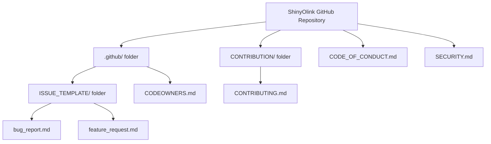

# Chapter 8: Project Governance & Contributions

Welcome back, `ShinyOlink` enthusiast! In [Chapter 7: Automated Deployment Pipelines](chapter7.md), we explored how `ShinyOlink` is automatically built, tested, and deployed, ensuring you always get the latest version. This process is all about the *code* and its journey from a developer's computer to your web browser.

But a successful software project isn't just about code; it's also about **people** – the developers who build it, the users who use it, and anyone who wants to help make it better. How do we ensure everyone can interact, propose ideas, fix issues, and contribute in a smooth, respectful, and organized way?

## What is "Project Governance & Contributions"?

Imagine `ShinyOlink` is a shared community garden. Many people want to plant things, help take care of it, or suggest new flowers. If there are no rules or guidelines, it could become messy quickly, with people planting anywhere or arguing about what to grow.

**The main problem "Project Governance & Contributions" solves is this:** How do we create a clear "rulebook" and a "customer service" department for `ShinyOlink`? This ensures the project stays healthy, high-quality, and is a welcoming place for everyone involved, whether they're reporting a tiny bug or proposing a huge new feature.

Let's use a common scenario: You're using `ShinyOlink` and discover a small bug, or you have a brilliant idea for a new analysis feature. How do you tell the project team? Or, perhaps you're a developer yourself and want to contribute a code fix. How do you do it in a way that helps the project, rather than causing confusion? This chapter will guide you through the "rules of the road" for `ShinyOlink`.

## Key Concepts: The Project's Rulebook

`ShinyOlink` (like many open-source projects) uses specific documents and processes to manage its community and contributions. Think of these as different sections of the project's "rulebook":

| Document Type       | What it Is                                                               | Analogy                                     | Purpose                                                      |
| :------------------ | :----------------------------------------------------------------------- | :------------------------------------------ | :----------------------------------------------------------- |
| **Issue Templates** | Pre-formatted forms for reporting bugs or suggesting new features.         | "Help Desk Tickets" with specific questions. | Ensures clear, consistent information for problems/ideas.    |
| **Contributing Guide** | A document explaining how to propose code changes or other contributions. | "How-to Guide" for helping the project.     | Guides contributors on the best way to submit their work.    |
| **Code of Conduct** | Rules for respectful and positive behavior in the community.               | "Community Agreement" on good manners.      | Fosters a welcoming and safe environment for everyone.      |
| **Security Policy** | Guidelines for how to report security vulnerabilities privately.           | "Secret Hotline" for urgent safety issues.  | Ensures sensitive issues are handled responsibly and quickly. |

These documents help manage the "health" of the `ShinyOlink` project, much like the factory line (from Chapter 7) manages the code's health.

## How to Interact with `ShinyOlink` (Your Use Case)

Let's walk through how you, as a user or potential contributor, would interact with these guidelines. The primary place for these interactions is typically the project's **GitHub repository**, which is where `ShinyOlink`'s code lives.

### Scenario 1: You Found a Bug or Have a New Idea!

If you find something broken or think of a cool new feature, you'd typically go to the "Issues" tab on the `ShinyOlink` GitHub page.

1.  **Report a Bug:**
    *   You'd click "New issue" and then choose a "Bug report" template.
    *   This template asks you specific questions like "What is the bug?", "How can we reproduce it?", and "What did you expect to happen?". This helps the developers understand and fix the problem quickly.

    Here's a simplified look at the kind of information the `Bug report` template (`.github/ISSUE_TEMPLATE/bug_report.md`) asks for:

    ```markdown
    # Bug report
    **Describe the bug**
    A clear and concise description of what the bug is.

    **To Reproduce**
    Steps to reproduce the behavior:
    1. Go to '...'
    2. Click on '....'
    3. Scroll down to '....'
    4. See error

    **Expected behavior**
    A clear and concise description of what you expected to happen.

    **Desktop (please complete the following information):**
     - OS: [e.g. iOS]
     - Browser [e.g. chrome, safari]
    ```
    This ensures you provide all the necessary details, similar to a good doctor asking for symptoms.

2.  **Request a Feature:**
    *   Similarly, you'd choose a "Feature request" template.
    *   This template guides you to describe the problem your idea solves, your proposed solution, and any alternatives you've considered.

    Here's a simplified view of the `Feature request` template (`.github/ISSUE_TEMPLATE/feature_request.md`):

    ```markdown
    # Feature request
    **Is your feature request related to a problem? Please describe.**
    A clear and concise description of what the problem is. Ex. I'm always frustrated when [...]

    **Describe the solution you'd like**
    A clear and concise description of what you want to happen.

    **Describe alternatives you've considered**
    A clear and concise description of any alternative solutions or features you've considered.
    ```
    This helps the `ShinyOlink` team understand the value of your idea and discuss it effectively.

### Scenario 2: You Want to Contribute Code!

If you're interested in directly helping improve `ShinyOlink` by writing code (e.g., fixing a bug, adding a small feature), you'll want to consult the **Contributing Guide**.

1.  **Read the Contributing Guide:**
    *   This document (`CONTRIBUTION/CONTRIBUTING.md`) acts as your roadmap. It explains the best way to get your changes into the project.
    *   It covers topics like how to "fork" the project (make your own copy), make your changes, and then submit a "Pull Request" (PR) – which is how you propose your changes to the original project.

    The Contributing Guide starts with a clear welcome:

    ```markdown
    # Contributing Guidelines

    *Pull requests, bug reports, and all other forms of contribution are welcomed and highly encouraged!* :octocat:

    ### Contents

    - [Code of Conduct](#book-code-of-conduct)
    - [Asking Questions](#bulb-asking-questions)
    - [Opening an Issue](#inbox_tray-opening-an-issue)
    # ... much more ...
    ```
    It's your first stop for understanding how to help!

2.  **Submit a Pull Request (PR):**
    *   After you make your changes, you'd create a Pull Request on GitHub. This is like saying, "Hey, I've got some changes here. Can you review them and add them to the main project?"
    *   The Contributing Guide often gives tips on writing good PR descriptions and commit messages.

### Scenario 3: Being a Good Community Member

All interactions within the `ShinyOlink` community (whether on GitHub, in discussions, or in code reviews) are expected to follow the **Code of Conduct**.

1.  **Understand the Code of Conduct:**
    *   This document (`CODE_OF_CONDUCT.md`) clearly outlines expected behaviors (e.g., being respectful, providing constructive feedback) and unacceptable behaviors (e.g., harassment, insulting comments).
    *   It also describes how any violations will be handled to ensure a safe and positive environment for everyone.

    The `ShinyOlink` Code of Conduct emphasizes a positive environment:

    ```markdown
    # Contributor Covenant Code of Conduct

    ## Our Pledge

    We as members, contributors, and leaders pledge to make participation in our
    community a harassment-free experience for everyone, regardless of age, body
    size, visible or invisible disability, ethnicity, sex characteristics, gender
    identity and expression, level of experience, education, socio-economic status,
    nationality, personal appearance, race, religion, or sexual identity
    and orientation.

    We pledge to act and interact in ways that contribute to an open, welcoming,
    diverse, inclusive, and healthy community.

    ## Our Standards

    Examples of behavior that contributes to a positive environment for our
    community include:

    * Demonstrating empathy and kindness toward other people
    * Being respectful of differing opinions, viewpoints, and experiences
    * Giving and gracefully accepting constructive feedback
    # ... more standards and enforcement details ...
    ```
    This document is crucial for maintaining a healthy community.

### Scenario 4: You Found a Security Vulnerability (Important!)

If you ever discover a potential security issue in `ShinyOlink` (e.g., a way to access private data or break the application in a harmful way), it's critical to report it **privately**, not publicly.

1.  **Consult the Security Policy:**
    *   The `SECURITY.md` file tells you exactly how to report such issues. For `ShinyOlink`, it explicitly states **not** to file a public issue, but to send an email to a specific address (`oss@jessesquires.com`).
    *   This allows the developers to fix the vulnerability before malicious actors can exploit it.

    The `ShinyOlink` Security Policy is very clear:

    ```markdown
    # Security Policy

    If you discover a security issue, please bring it to our attention right away!

    ## Reporting a Vulnerability
     
    Please **DO NOT** file a public issue to report a security vulberability, instead send your report privately to **oss@jessesquires.com**. This will help ensure that any vulnerabilities that are found can be [disclosed responsibly](https://en.wikipedia.org/wiki/Responsible_disclosure) to any affected parties.
    ```
    Following this policy ensures that `ShinyOlink` remains safe for everyone.

## Under the Hood: Where the Rulebook Lives

These important "rulebook" documents are not just ideas; they are actual files stored within the `ShinyOlink` project on GitHub. They are typically located in special, easy-to-find places.

### Step-by-Step Location Guide

When you visit the `ShinyOlink` project on GitHub, you'll find these governance documents in specific folders:

1.  **Issue Templates:** These live in the `.github/ISSUE_TEMPLATE/` folder. GitHub automatically uses these files when someone clicks "New Issue."
2.  **Code of Conduct:** The `CODE_OF_CONDUCT.md` file is usually found right at the top level of the project.
3.  **Contributing Guide:** The `CONTRIBUTION/CONTRIBUTING.md` file is in a dedicated `CONTRIBUTION` folder.
4.  **Security Policy:** The `SECURITY.md` file is also often found at the top level or within the `.github/` folder.
5.  **Code Owners:** The `CODEOWNERS.md` file (in `.github/`) automatically requests reviews from specific people when certain parts of the code are changed.

Here's a simplified diagram showing where these files are within the GitHub repository:



### Diving into the Code: The Files Themselves

While we've seen snippets above, it's helpful to know these are just plain text files written in Markdown. GitHub then renders them nicely on the website.

For example, the `CODEOWNERS.md` file helps automate the review process for contributions:

```markdown
# CODEOWNERS.md (Simplified)
# https://help.github.com/articles/about-codeowners/

# These owners will be the default owners for everything in
# the repo. Unless a later match takes precedence, they will
# be requested for review when someone opens a PR.
*       @JD2112
```
**Explanation:** This small file tells GitHub that `@JD2112` (likely the main maintainer or a team) should be asked to review any changes (Pull Requests) that affect the project. This ensures that important changes are always looked at by someone responsible.

These documents are the bedrock of `ShinyOlink`'s community and development process. They formalize how the project functions, making it more predictable, fair, and welcoming for everyone involved.

## Conclusion

In this final chapter, you've learned about the vital concept of **Project Governance & Contributions** in `ShinyOlink`:

*   It's the **"rulebook" and "customer service" department** that ensures the project's health, quality, and community interactions.
*   You now understand the purpose and location of key documents like **Issue Templates**, the **Contributing Guide**, the **Code of Conduct**, and the **Security Policy**.
*   You've seen how these documents guide you in reporting bugs, requesting features, contributing code, and behaving respectfully within the `ShinyOlink` community.

By following these guidelines, you can effectively interact with the `ShinyOlink` project, whether you're a user providing feedback or a developer contributing code. This structured approach helps ensure `ShinyOlink` continues to grow and improve as a valuable tool for Olink proteomics analysis, thanks to the collective efforts of its community!