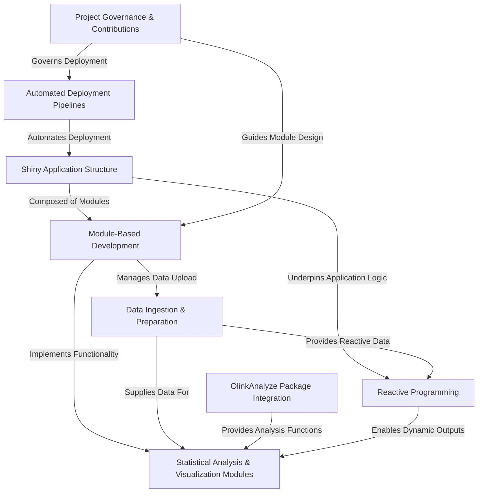

# Tutorial: ShinyOlink

ShinyOlink is a user-friendly **Shiny application** designed to simplify the *analysis of Olink proteomics data*. It allows users to **upload their raw data**, then performs various *statistical tests* and generates *interactive visualizations* by leveraging the specialized `OlinkAnalyze` R package, making complex bioinformatics accessible to researchers. The project uses a *modular design* and has *automated deployment pipelines* for efficient delivery and maintenance.

## Visual Overview

## Chapters

1. [Manual](chapter1.md)
2. [Olink Proteomics](chapter2.md)
3. [Shiny,R and Docker](chapter3.md)
4. [FAQs](chapter4.md)

---