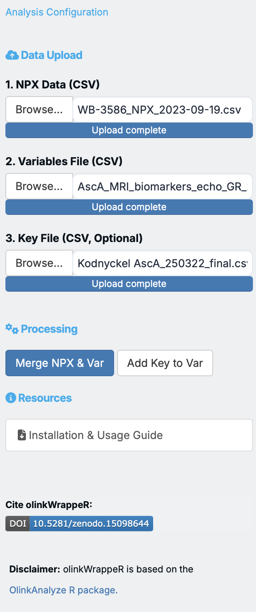

---
hide:
  - navigation
---

# Getting Started

???+ important "Note to Users"

    For each analysis, a progress bar will appear to indicate that calculations are in progress.

    - If any errors occur during analysis, an error message will be displayed.
    - Make sure your data is properly formatted before uploading:
        - **NPX Data** should contain columns for `SampleID`, `Assay`, and `NPX` values.
        - **Key File** should map `SampleID` to `SUBJID` (Subject Identifier).
        - **Variables File** should contain additional variables for each `SUBJID` (Subject Identifier).
        - **NPX Data 2** is optional and should contain columns for `SampleID`, `Assay`, and `NPX` values. For bridge selecotr, normalization or LME analysis, you need to upload NPX Data 2.

    This app provides a user-friendly interface for comprehensive analysis of Olink™ data.  

## Analysis configuration

### Data Input

The app requires specific data files to begin analysis.

- Upload NPX Data (CSV)
- Upload Key File (CSV, optional)
- Upload Variables File (CSV)

Please check the [Usage](index.md#usage) for more details about the input files.

{width=80%}

### Processing

After uploading your files, click **"Merge NPX & Variables"** button to combine them into a single dataset for analysis. You can preview the merged data in the **A. Data Preview** tab.

???+ tip "Tip"

    Using key file is optional but recommended to use as it reduces the computation time and memory usage. The NPX data file is quiet big and if you have large number of variables, it is recommended to use key file.

## A. Data Preview

### Exclude QC warnings samples

### Dataset Explorer

## B. Preprocessing

This section allows you to clean and prepare your data for statistical analysis.

### 1 **Bridge Selector:** 
The bridge selection function selects a number of bridge samples based on the input data. Bridge samples are used to normalize two dataframes/projects that have been ran at different time points, hence, a batch effect is expected. It selects samples that have good detectability (if applicable), pass quality control, and cover a wide range of data points.

**How to run:** 
- Select the target number of sampels, default: 8
- Select mamimum allowed missing frequency, default: 0.1
- Clcik "Identify Bridge Samples" button to identify the bridge samples.
- The bridge samples will be displayed in the table below.

### 2 **Normalization:** 
The Olink® normalization function normalizes NPX values between two different datasets or one Olink® dataset to a set of reference medians.

???+ warning "normalization"
     `olinkWrapper` provides normalization only on selected method and reference Sample ID. For detailed information about normalization, please refer to the Olink® documentation.

??? info "Normalization from Olink"
    The function handles four different types of normalization:

    - **Bridging normalization**: One of the dataframes is adjusted to another using overlapping samples (bridge samples). The overlapping samples should have the same IDs between dataframes. Adjustment is made using the median of the paired differences between the bridge samples. For more information on bridging, consult the Introduction to bridging Olink® NPX datasets tutorial.
    - **Subset normalization**: A subset of samples is used to normalize two dataframes, one of which is used as a reference_project. Adjustment is made using the differences of medians between the sample subsets from the two dataframes. Subset normalization is useful if no bridge samples were included and one can assume that the distribution of the two datasets is very similar.
    - **Reference median normalization**: Works only on one dataframe. This is effectively subset normalization, but using difference of medians to pre-recorded median values. df1, overlapping_samples_df1 and reference_medians need to be specified.
    - **Cross-product bridging**: Similar to bridging normalization but bridging across products, for example bridging Explore 3072 data to Explore HT data. Overlapping samples are run on both products and used to determine which assays are bridgeable and what method should be used to bridge each assay. For more information on the between-product bridging methodology, consult the Bridging across NGS-based Olink® products Tutorial.

### 3 **LOD (Limit of Detection):** 
The `olink_lod` function adds LOD information to an Explore HT or Explore 3072 NPX dataframe. This function can incorporate LOD based on either an Explore dataset’s negative controls or using predetermined fixed LOD values, which can be downloaded from the Document Download Center at olink.com, or using both methods. The default LOD calculation method is based off of the negative controls. If an NPX file is intensity normalized, both intensity normalized and PC normalized LODs are provided.

**How to run:** 

- To find out proteins with >50% LOD values, click on 'integrate LOD data'.
- Results will be displayed in a table.
- Use the "Download Results" button to save the LOD results as an Excel file.
- Use the "removed flagged proteins" button to exclude the proteins with >50% LOD values.

### 4 **Outlier Detection:** 

This tool helps you identify samples that are statistically unusual, which may be due to experimental errors or biological outliers.

- **UMAP Distances:** The app uses Uniform Manifold Approximation and Projection (UMAP) to visualize sample clusters and calculate distances between samples. 
- **Automatic Highlighting:** Samples that fall beyond a specific standard deviation threshold are automatically highlighted as potential outliers.
- **Exclusion:** You can exclude these samples with a single click, and they will be removed from all subsequent plots and statistical tests.

**How to run:** 

- Selecte the standard deviation threshold, default: 2.5
- Click "Run Outlier Detection" button to run the analysis.
- The outliers will be highlighted in the UMAP plot.
- You can exclude the outliers by clicking on the "Exclude Outliers" button.

## C. Statistical Analysis

The app provides several common statistical tests to find meaningful differences in your data.

### 1. Descriptive Statistics

### 2. Normality Test

This test determines if your data follows a normal (bell-shaped) distribution. Many parametric tests, like the T-test and ANOVA, assume normality.

- **Statistical Tests:** Choose between **Shapiro-Wilk** (best for small samples) and **Kolmogorov-Smirnov** (against a normal distribution) tests.
- **Visual Feedback:** Each analysis generates both a **Histogram** (with a red density curve) and a **QQ-plot** to help you qualitatively assess normality.
- **"All Proteins" Mode:** You can visualize the distribution of every single data point in your dataset at once to see the global data layout.

### 3. T-test
The olink_ttest function performs a Welch 2-sample t-test or paired t-test at confidence level 0.95 for every protein (by OlinkID) for a given grouping variable. It corrects for multiple testing using the Benjamini-Hochberg method (“fdr”). Adjusted p-values are logically evaluated towards adjusted p-value < 0.05. The resulting t-test table is arranged by ascending p-values.

**How to run:** 

- Navigate to the "T-Test" tab.
- Select a grouping variable and specify its type (Character or Factor).
- Click "Run T-Test" to perform the analysis.
- Results will be displayed in a table.
- Use the "Download Results" button to save the T-Test results as an Excel file.

### 4. Wilcoxon Test
The olink_wilcox function performs a 2-sample Mann-Whitney U test or paired Mann-Whitney U test at confidence level 0.95 for every protein (by OlinkID) for a given grouping variable. It corrects for multiple testing using the Benjamini-Hochberg method (“fdr”). Adjusted p-values are logically evaluated towards adjusted p-value<0.05. The resulting Mann-Whitney U table is arranged by ascending p-values.

**How to run:** 

- Navigate to the "Wilcoxon Test" tab.
- Select a grouping variable and specify its type (Character or Factor).
- Select from the drop down menu `Two Sided` (**default**), `Greater`, or `Less`.
- Click "Run Wilcoxon Test" to perform the analysis.
- Results will be displayed in a table.
- Use the "Download Results" button to save the Wilcoxon Test results as an Excel file.

### 5. ANOVA (Analysis of Variance): 
The olink_anova function performs an ANOVA F-test for each assay (by OlinkID) using Type III sum of squares. The function handles both factor and numerical variables, and/or confounding factors.

*   **Requirement:** Samples with missing variable information or factor levels are excluded from the analysis. Character columns in the input data frame are converted to factors.

Control samples and control assays should be removed before using this function.

*   **Crossed/interaction analysis, i.e. A*B formula notation, is inferred from the variable argument in the following cases:**

    - `c(‘A’,‘B’)`
    - `c(‘A:B’)`
    - `c(‘A:B’, ‘B’) or c(‘A:B’, ‘A’)`
    - For covariates, crossed analyses need to be specified explicitly, i.e. two main effects will not be expanded with a `c(‘A’,‘B’)` notation. Main effects present in the variable take precedence.

* Adjusted p-values are calculated using the Benjamini & Hochberg (1995) method (`fdr`). The threshold is determined by logic evaluation of `Adjusted_pval < 0.05`. Covariates are not included in the p-value adjustment.

**How to run:**

- In the "ANOVA" tab, select a grouping variable and its type.
- Choose the number of covariates (0-4, max.5) if needed.
- If covariates are selected, choose the covariate variables from the dropdown menus.
- Click "Run ANOVA" to perform the analysis.
- Results will be displayed in a table.
- Use the "Download Results" button to save the ANOVA results as an Excel file.

### 6. ANOVA Post-hoc: 

olink_anova_posthoc performs a post-hoc ANOVA test with Tukey p-value adjustment per assay (by OlinkID) at confidence level 0.95.

The function handles both factor and numerical variables and/or covariates. The post-hoc test for a numerical variable compares the difference in means of the outcome variable (default: NPX) for 1 standard deviation (SD) difference in the numerical variable, e.g. mean NPX at mean (numerical variable) versus mean NPX at mean (numerical variable) + 1*SD (numerical variable).

Control samples and control assays (AssayType is not “assay”, or Assay contains “control” or “ctrl”) should be removed before using this function.

???+ warning "ANOVA Post-hoc"
    Please ensure you have run the ANOVA test before attempting to run the ANOVA Post-hoc test, as it relies on the results from that analysis.

**How to run:** 
After running ANOVA (with significant results), 

- Select `Effect Variable` from the drop-down menu,
- Check if you want to run only on significant results, (**default: checked**)
- Select the `Adjustment` method from the drop-down menu, (**default: Tukey**)
- Check if you want to `calculate Group Means` (**default: unchecked**)
- *Custom Assay List*: If you want to run the analysis on a subset of assays, you can provide a list of assays to the `Assay List` argument. The assays should be separated by commas.
- Click "Run ANOVA Post-hoc" to perform the analysis.
- Results will be displayed in a table.
- Use the "Download Results" button to save the ANOVA Post-hoc results as an Excel file.

### 7. Linear Mixed Effects (LME): 

The olink_lmer fits a linear mixed effects model for every protein (by OlinkID) in every panel. The function handles both factor and numerical variables and/or covariates.

Samples with missing variable information or factor levels are excluded from the analysis. Character columns in the input data frame are converted to factors.

Crossed/interaction analysis, i.e. A*B formula notation, is inferred from the variable argument in the following cases:

- `c('A','B')`
- `c('A:B')`
- `c('A:B', 'B')` or `c('A:B', 'A')`
For covariates, crossed analyses need to be specified explicitly, i.e. two main effects will not be expanded with a `c('A','B')` notation. Main effects present in the variable take precedence.

Adjusted p-values are calculated using the Benjamini & Hochberg (1995) method (`fdr`). The threshold is determined by logic evaluation of `Adjusted_pval < 0.05`. Covariates are not included in the p-value adjustment.

**How to run:** 

- Select `Outcome Variable` from the drop-down menu (**default: NPX**)
- Select `Fixed Effects` from the drop-down menu.
- Select `Random Effects` from the drop-down menu.
- Click "Run LME" to perform the analysis.
- Results will be displayed in a table.
- Use the "Download Results" button to save the LME results as an Excel file.

### 8. LME Post-hoc
Use the post-hoc function to find specific differences.

## D. Exploratory Analysis

Exploratory analysis helps you visualize the overall structure of your data and find patterns without making specific assumptions.

### 1. PCA Plot (Principal Component Analysis): 
PCA is a method that reduces the dimensionality of your data, allowing you to visualize hundreds of proteins in a simple 2D or 3D plot. Samples that are similar in protein expression will cluster together.

**How to run:** Select the variables to color or shape your plot and click "PCA."

### 2. UMAP Plot (Uniform Manifold Approximation and Projection): 
Similar to PCA, UMAP is a non-linear dimensionality reduction technique that is often more effective at revealing complex relationships and clusters in your data.

**How to run:** Select your grouping variables and click "UMAP."

## E. Visualization

The app generates a variety of plots to help you understand and present your results.

### 1. Box Plot: 
A box plot provides a quick visual summary of the distribution of NPX values for a single protein across different groups, showing the median, quartiles, and outliers.

### 2. Distribution Plot: 
This plot, often a histogram or density plot, shows the frequency distribution of NPX values for a given protein.

### 3. LME Plot: 
This plot visualizes the results of a Linear Mixed Effects model, often showing the protein expression change over time or across different conditions, accounting for within-subject variability.

### 4. Pathway Heatmap: 
A heatmap is a color-coded matrix that shows the expression levels of proteins involved in a specific biological pathway. It requires you to first run a Pathway Enrichment Analysis.

!!! important "Pathway Heatmap"
    Please ensure you have run the Pathway Enrichment Analysis before attempting to create a Pathway Heatmap, as it relies on the results from that analysis.

### 5. QC Plot (Quality Control): 
This plot helps you assess the quality of your data, often by showing the overall NPX distribution across all samples or assays.

### 6. Heatmap Plot: 
A general heatmap that displays the expression of many proteins across many samples, allowing you to see global patterns and clusters of co-expressed proteins.

### 7. Volcano Plot: 
A key visualization for T-test or Wilcoxon results. It plots the statistical significance against the magnitude of change (estimate) for all proteins.

- **Dynamic P-value Selection:** Choose to plot either **Adjusted P-values (FDR)** or **Unadjusted P-values** on the Y-axis. The significance threshold line and point colors will update automatically.
- **Flexible Threshold:** Adjust the significance threshold (e.g., 0.05 vs 0.01) to see the horizontal line and highlighted proteins move in real-time.
- **Custom Coloring:** Significant proteins are highlighted in **Red**, while non-significant ones are in **Grey**, making it easy to identify relevant biomarkers.
- **Smart Annotation:** Toggle protein labels to annotate the top significant proteins using `ggrepel` to ensure labels don't overlap.

### 8. Violin Plot: 
Similar to a box plot, but it also shows the density of the data at different NPX values, providing a more detailed look at the data distribution.

- In the "Violin Plot" tab, select a protein and a grouping variable.
- Specify the variable type for the grouping variable.
- Click "Generate Violin Plot" to create the plot.
- Use the "Download Plot" button to save the Violin plot.

## F. Pathway Enrichment Analysis

This is a powerful method to go beyond individual protein analysis. It uses your list of significantly changed proteins (identified by a **T-test** or **Wilcoxon test**) and compares them to known biological pathways. It tells you which pathways are significantly represented in your list of proteins, helping you interpret your findings in a biological context.

!!! warning "Pathway Enrichment Analysis"
    Please ensure you have run either the T-test or Wilcoxon test before attempting to run the Pathway Enrichment Analysis, as it relies on the results from those analyses.

## G. Linear Regression

Linear regression is used to model the relationship between a protein's NPX value (dependent variable) and one or more other variables (independent variables), such as age, BMI, or a clinical score. This helps you identify proteins whose levels are associated with continuous variables.

## H. Analysis Report

This section provides a comprehensive summary of all the analyses performed in the session. It includes all the tables and plots generated in the previous sections, allowing you to download them all in one place.